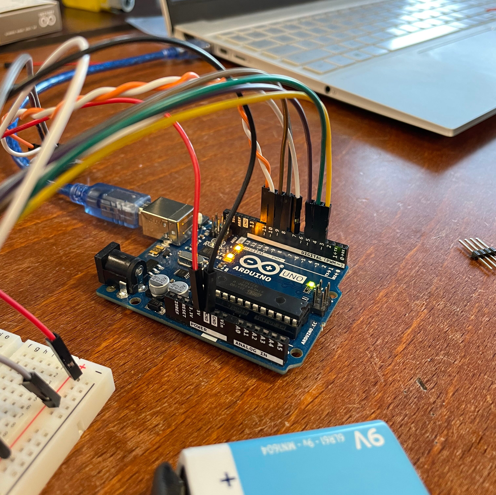
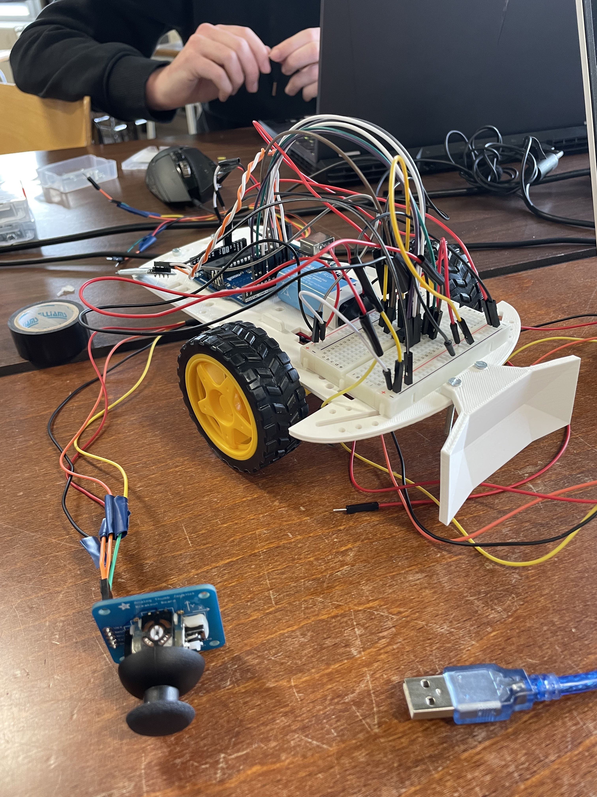
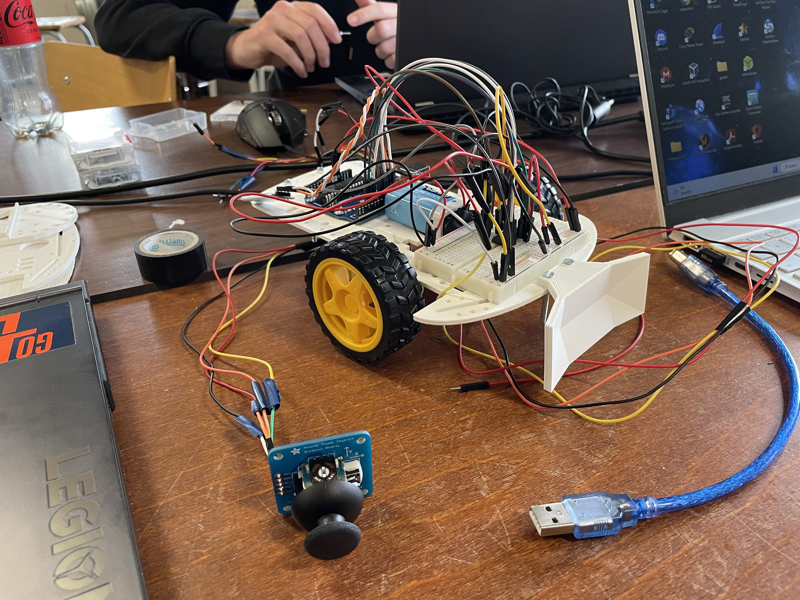
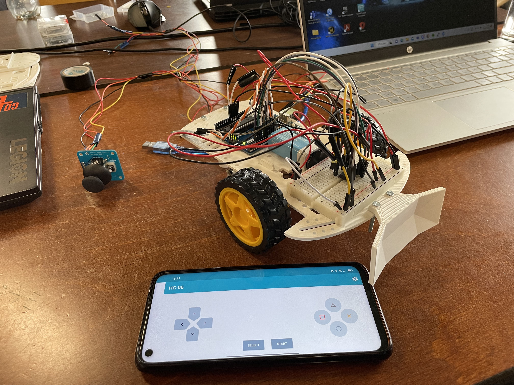

# System Engineering & Analysis - Project

As part of a Systems Engineering & Analysis project in 2023, my team (2 other students) and I designed and built a soccer robot that could play against other robots. The purpose of the project was to make mathematics more engaging for technical students. During this project, I mainly focused on the electronic circuit and programming the Arduino.

**Completed:** January 2023

## Soccer Robot

We made three different versions of the robot, the first robot was controllable by a wired joystick, the second was controlled by a mobile phone that connected to the robot via bluetooth, and the third was controlled by means of a wireless RF connection.

We built three versions of the robot, each with a different control method. The first version was controlled by a wired joystick, the second was controlled by a mobile phone via Bluetooth, and the third was controlled via a wireless RF connection.

We faced several challenges during the development process, such as designing a sturdy chassis that could withstand the impacts of collisions during the game. We also had to develop a reliable communication system between the robot and the joystick/mobile phone, as well as a robust algorithm for controlling the robot's movements on the field. We tackled these challenges through iterative testing and design, incorporating feedback from our teammates and professors.

The circuit of the robot contained the following parts:

- Arduino Uno
- L293D Motor Driver
- 2 x DC Motor
- Joystick
- Arduino Nano
- nRF24L01
- HC-06 Bluetooth module

The goal of our Systems Engineering & Analysis project was to make mathematics more engaging for technical students by designing and building a soccer robot that could play against other robots. Through the development of three different versions of the robot, each with a unique control method, we aimed to showcase the practical application of mathematical concepts in a fun and interactive manner.

During the project, I took on the responsibility of working on the electronic circuit and programming the Arduino, which allowed me to enhance my technical skills in hardware integration and software development. By collaborating closely with my team members and leveraging their expertise, we overcame challenges such as designing a durable chassis and implementing reliable communication systems.

Our soccer robot project not only achieved its educational objective but also demonstrated our ability to tackle complex engineering problems and deliver tangible results. The robot's functionality and adaptability showcased our proficiency in designing and building innovative solutions.

Looking back, I have achieved a deeper understanding of systems engineering principles, the importance of effective teamwork, and the significance of iterative development processes. This project has solidified my passion for combining engineering and education, inspiring me to continue exploring projects that merge technical knowledge with practical applications.

Overall, the soccer robot project has been a rewarding experience that has broadened my skill set, allowed me to contribute to a meaningful educational initiative, and reinforced my commitment to continuous learning and growth in the field of engineering.

### L293D Scheme
https://lastminuteengineers.com/l293d-dc-motor-arduino-tutorial/

